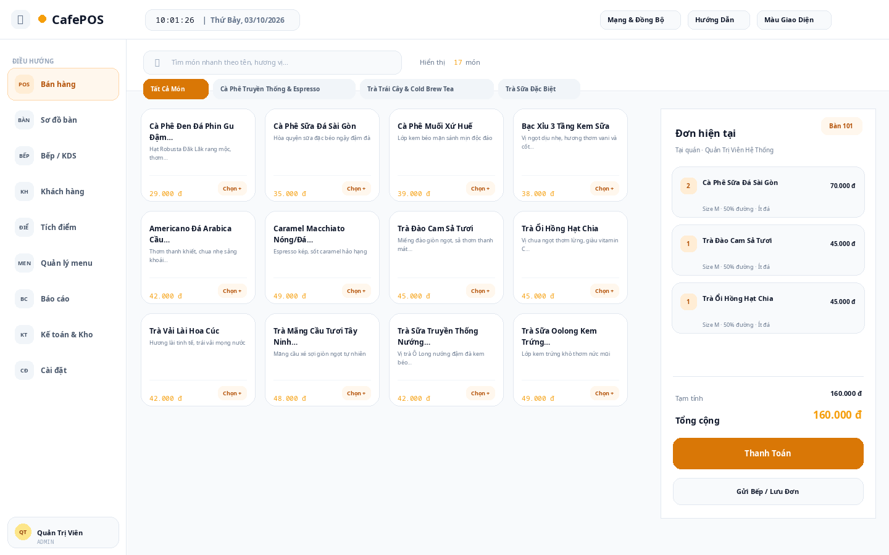
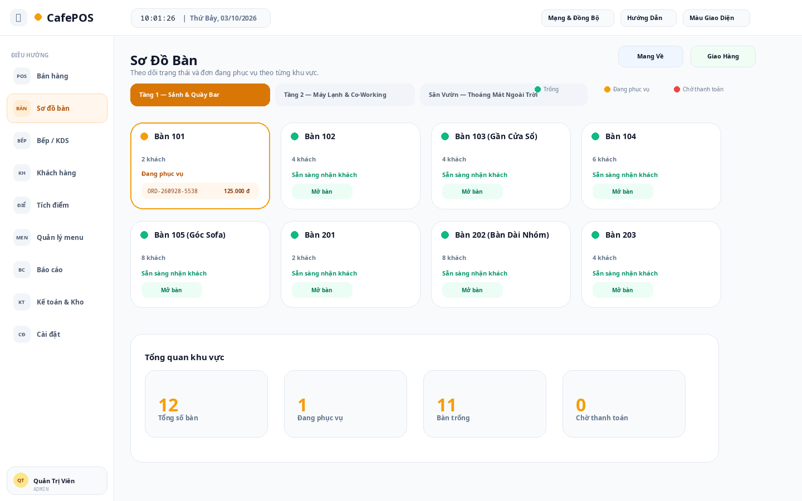
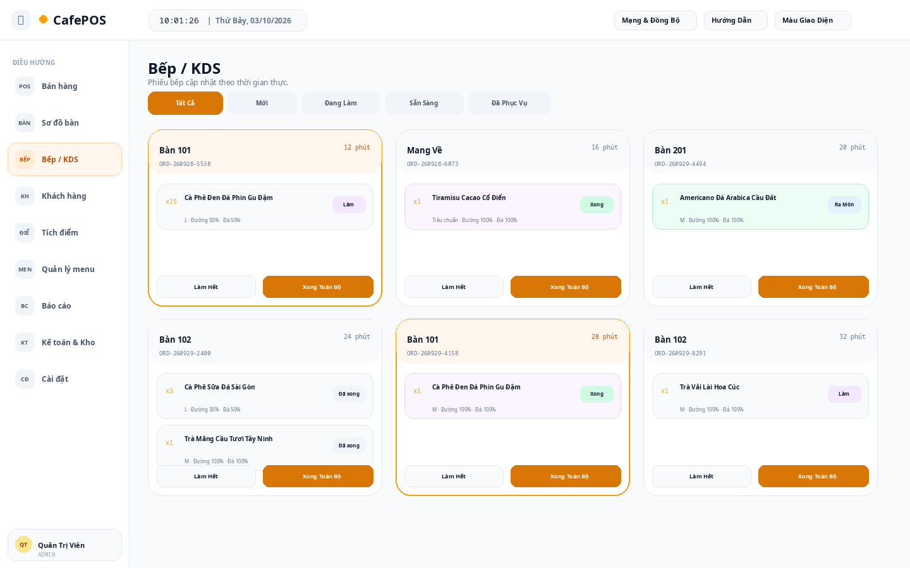

# ☕ CafePOS

**CafePOS** là ứng dụng quản lý bán hàng dành cho quán cà phê, trà sữa và các mô hình kinh doanh F&B quy mô nhỏ đến vừa.  
Dự án hướng đến việc giúp cửa hàng quản lý hoạt động bán hàng hằng ngày trên một hệ thống trực quan, dễ sử dụng và có thể vận hành trong mạng nội bộ.



---

## 📌 Giới thiệu dự án

CafePOS được xây dựng nhằm số hóa các công việc thường gặp tại quán như:

- Tiếp nhận và xử lý đơn hàng.
- Quản lý bàn và trạng thái phục vụ.
- Theo dõi món cần chế biến tại khu vực bếp/quầy.
- Quản lý sản phẩm, kho và các thông tin liên quan đến bán hàng.
- Theo dõi doanh thu và báo cáo hoạt động.
- Hỗ trợ nhiều vị trí làm việc trong cùng một hệ thống.

Bên cạnh ứng dụng CafePOS, dự án có **CafePOS Website** dùng để giới thiệu sản phẩm, hiển thị hình ảnh giao diện và cung cấp khu vực tải ứng dụng.

---

## 🎯 Mục đích của ứng dụng

CafePOS được phát triển với các mục tiêu chính:

1. **Đơn giản hóa quy trình bán hàng**  
   Giúp nhân viên tạo đơn, chọn món, quản lý bàn và xử lý đơn hàng nhanh hơn.

2. **Hạn chế ghi chép thủ công**  
   Thông tin bán hàng được quản lý tập trung thay vì ghi sổ hoặc xử lý rời rạc.

3. **Hỗ trợ phối hợp giữa các bộ phận**  
   Đơn hàng có thể được theo dõi từ khu vực bán hàng đến bếp/quầy pha chế.

4. **Hỗ trợ quản lý cửa hàng**  
   Chủ quán hoặc người quản lý có thể theo dõi tình hình bán hàng, kho, doanh thu và các báo cáo cần thiết.

5. **Phù hợp với mô hình quán nhỏ và vừa**  
   Hệ thống hướng đến cách cài đặt và sử dụng đơn giản, có thể hoạt động trong mạng LAN của cửa hàng.

---

## ⚙️ Các hoạt động chính của CafePOS

### 🛒 1. Bán hàng / POS

Nhân viên có thể:

- Chọn món từ danh sách sản phẩm.
- Thêm món vào đơn hàng.
- Điều chỉnh số lượng.
- Theo dõi tổng tiền.
- Xử lý đơn tại quầy.
- Theo dõi trạng thái đơn hàng.


---

### 🪑 2. Quản lý bàn

CafePOS hỗ trợ theo dõi các bàn trong quán:

- Bàn trống.
- Bàn đang phục vụ.
- Bàn đã có đơn.
- Chọn bàn để tạo hoặc xem đơn hàng.
- Hỗ trợ nhân viên quan sát tình trạng phục vụ trực quan hơn.



---

### 👨‍🍳 3. Bếp / KDS

Khu vực bếp hoặc quầy pha chế có thể sử dụng màn hình KDS để:

- Nhận món cần chế biến.
- Theo dõi các đơn đang chờ.
- Xác định món thuộc bàn hoặc đơn nào.
- Cập nhật tiến độ xử lý món.
- Hạn chế việc truyền món bằng giấy hoặc thông báo thủ công.



---

### 📦 4. Quản lý kho và kế toán

Hệ thống hỗ trợ các hoạt động quản lý như:

- Theo dõi hàng hóa và nguyên liệu.
- Kiểm tra thông tin nhập/xuất kho.
- Theo dõi số liệu liên quan đến hoạt động kinh doanh.
- Hỗ trợ tổng hợp thông tin phục vụ quản lý cửa hàng.


---

### 📊 5. Báo cáo và theo dõi hoạt động

CafePOS hướng đến việc cung cấp cho người quản lý cái nhìn tổng quan về hoạt động của cửa hàng, bao gồm:

- Doanh thu.
- Đơn hàng.
- Sản phẩm bán ra.
- Hoạt động theo ca hoặc thời gian.
- Các số liệu cần thiết để theo dõi tình hình kinh doanh.

---

### 🔐 6. Đăng nhập và sử dụng hệ thống

Người dùng truy cập CafePOS thông qua màn hình đăng nhập để sử dụng các chức năng được cung cấp trong hệ thống.


---

## 🚀 Hướng dẫn sử dụng

### Bước 1 — Cài đặt và khởi động CafePOS

Cài đặt CafePOS trên máy được chọn làm máy chủ hoặc máy vận hành chính của quán.

Sau khi cài đặt, khởi động hệ thống và đảm bảo CafePOS đang hoạt động.

Trong môi trường phát triển, địa chỉ truy cập có thể có dạng:

```text
http://localhost:3000
```

Nếu CafePOS chạy trên một máy khác trong cùng mạng LAN, có thể truy cập bằng địa chỉ IP của máy chủ, ví dụ:

```text
http://192.168.1.5:3000
```

---

### Bước 2 — Đăng nhập

1. Mở CafePOS trên trình duyệt hoặc thiết bị được sử dụng.
2. Nhập thông tin tài khoản.
3. Đăng nhập vào hệ thống.
4. Chọn khu vực chức năng cần sử dụng.

---

### Bước 3 — Tạo đơn bán hàng

Quy trình cơ bản:

1. Chọn **Bán hàng / POS**.
2. Chọn bàn nếu khách sử dụng tại quán.
3. Chọn món khách yêu cầu.
4. Kiểm tra số lượng và nội dung đơn.
5. Xác nhận đơn hàng.
6. Theo dõi quá trình xử lý món.
7. Hoàn tất đơn khi kết thúc phục vụ.

---

### Bước 4 — Theo dõi đơn tại bếp/quầy

Nhân viên bếp hoặc pha chế:

1. Mở màn hình **Bếp / KDS**.
2. Xem các món đang chờ xử lý.
3. Tiến hành chế biến.
4. Cập nhật trạng thái món sau khi hoàn thành.

---

### Bước 5 — Quản lý cửa hàng

Người quản lý có thể truy cập các khu vực liên quan để:

- Kiểm tra sản phẩm.
- Theo dõi kho.
- Xem đơn hàng.
- Theo dõi doanh thu.
- Kiểm tra các báo cáo hoạt động.
- Quản lý thông tin phục vụ vận hành cửa hàng.

---

## 🌐 CafePOS Website

**CafePOS Website** là trang giới thiệu cho ứng dụng CafePOS.

Website được sử dụng để:

- Giới thiệu dự án.
- Trình bày các chức năng chính.
- Hiển thị screenshot của ứng dụng.
- Cho người dùng xem trước giao diện.
- Cung cấp hướng dẫn cơ bản.
- Dẫn tới khu vực tải ứng dụng hoặc bản phát hành.

Website sử dụng:

- HTML5
- CSS3
- Vanilla JavaScript

Không cần cài framework hoặc thực hiện bước build để chạy website.

### Chạy website

Có thể mở trực tiếp:

```text
index.html
```

Hoặc chạy local server bằng Python:

```bash
python -m http.server 8080
```

Sau đó truy cập:

```text
http://localhost:8080
```

---

## 🖼️ Hình ảnh giao diện

Các ảnh minh họa của CafePOS được lưu trong thư mục:

```text
screenshots/
```

Cấu trúc hiện tại:

```text
screenshots/
├── 01-login.png
├── 02-table-map.png
├── 03-pos.png
├── 04-kitchen.png
└── 05-accounting.png
```

---

## 📁 Cấu trúc CafePOS Website

```text
CafePOS-Website/
├── index.html
├── style.css
├── app.js
├── cafe.jpg
├── favicon.svg
├── README.md
└── screenshots/
    ├── 01-login.png
    ├── 02-table-map.png
    ├── 03-pos.png
    ├── 04-kitchen.png
    └── 05-accounting.png
```

---

## 👨‍💻 Tác giả

**Triết Võ**

- GitHub: `trietpko2002`
- Dự án: **CafePOS**
- Repository: `Cafe-Pos-Node.js`

CafePOS được phát triển với mục tiêu tạo ra một giải pháp quản lý bán hàng dễ tiếp cận cho quán cà phê và các mô hình F&B, đồng thời là dự án phục vụ quá trình nghiên cứu, học tập và phát triển kỹ năng xây dựng hệ thống phần mềm thực tế.

---

## 📄 Ghi chú

CafePOS vẫn có thể tiếp tục được phát triển và hoàn thiện thêm các chức năng trong tương lai.

Các screenshot trong repository được sử dụng nhằm minh họa giao diện và cách hoạt động của hệ thống. Khi phát hành phiên bản mới, hình ảnh và nội dung hướng dẫn có thể được cập nhật tương ứng.

---

## 📜 License

Vui lòng tham khảo thông tin giấy phép của repository trước khi sử dụng, chỉnh sửa hoặc phân phối lại mã nguồn.

---

<p align="center">
  <b>CafePOS — Quản lý bán hàng cho quán cà phê và mô hình F&B.</b>
</p>
